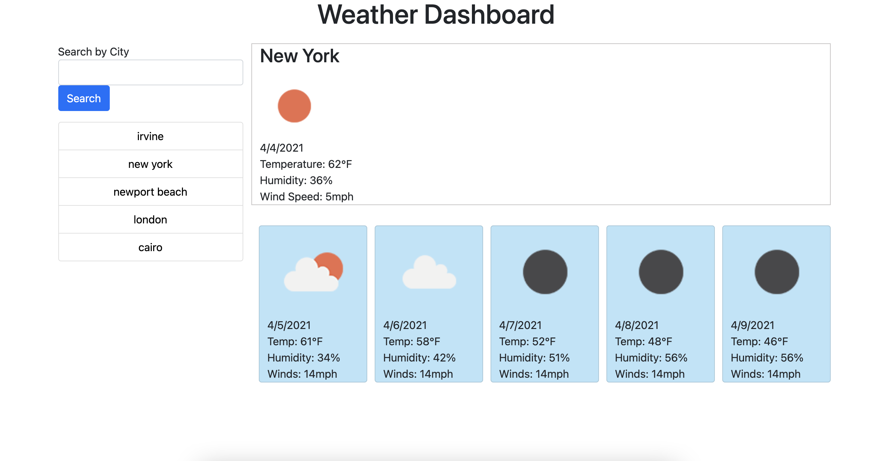

# Weather App

## Description
This is a weather application. Users are able to search by city and are given current weather conditions as well as a 5 day forecast. 

Technologies: HTML, CSS, Bootstrap, Javascript, Axios, RESTful API

### Deployed Link
[Weather Application](https://josephmnielsen.github.io/weatherApp/)

## Preview

## Contact

GitHub:  

- [/josephmnielsen](https://github.com/josephmnielsen)

Email: 

- [josephmnielsen@gmail.com](josephmnielsen@gmail.com)